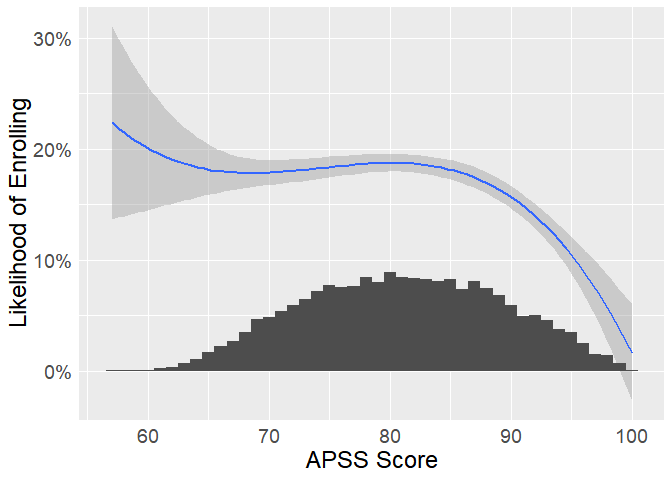
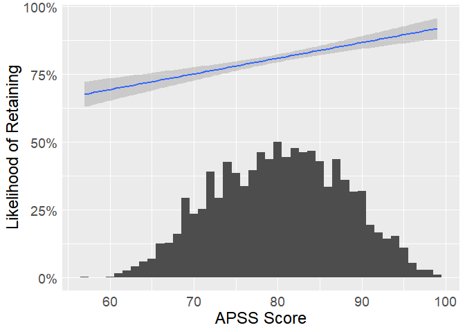
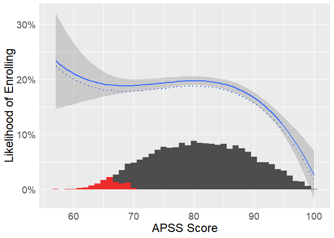

### Introduction

Over the past five years at Eckerd College, 17.2% of admitted FTIC
students have enrolled at the college. However, the percentage of
students who enrolled (i.e. yield) has ranged 16.2% to 18.3% from during
this same time period. Flucations in yield can have important
consequences for the makeup of the incoming class and enrollment
managenemt.

Here, we examine the effect of yield by similuating a 1% increase in
yield.

### APSS Scores

APSS scores are a composite score based on prospective students’ high
school GPA and standardized test scores. These scores range from 0 to
100 and they are used by the college to make decisions regarding
admission and financial aid.

High acheiving students are highly sought after by colleges.

And, as you might expect, students with higher APSS scores are more
likely to be retained through the start of their second year.

### Effect of Increased Yield

More text goes here…
